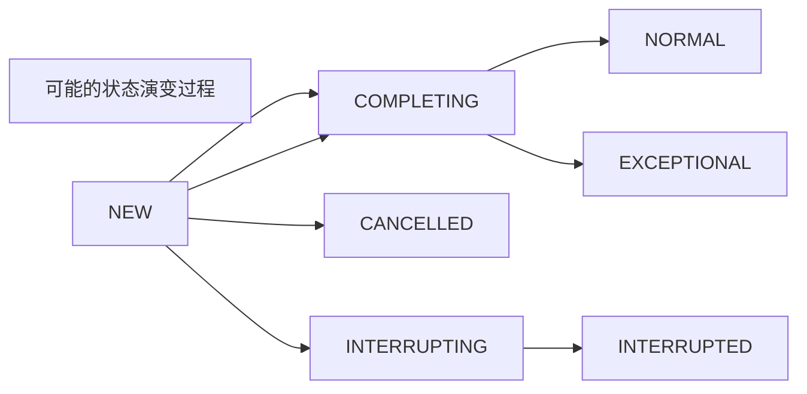

# FutureTask

> FutureTask是多线程任务执行的基本单位,包含了任务和返回结果

## 属性介绍

```java
private volatile int state; //任务运行状态
private static final int NEW          = 0; //任务初始化状态
private static final int COMPLETING   = 1; // 正在运行
private static final int NORMAL       = 2; // 完成
private static final int EXCEPTIONAL  = 3; // 异常
private static final int CANCELLED    = 4; // 取消
private static final int INTERRUPTING = 5; // 正在中断
private static final int INTERRUPTED  = 6; // 已中断
```



```java
private Callable<V> callable; // 底层任务单元
private Object outcome; // 任务运行结果
/** The thread running the callable; CASed during run() */
private volatile Thread runner; //运行任务的线程
/** Treiber stack of waiting threads */
private volatile WaitNode waiters;//等待节点
```

## 方法简介

```java
//判断任务是否被取消,包括线程中断
public boolean isCancelled() {
    return state >= CANCELLED;
}
```

```java
//任务最终状态是NORMAL,EXCEPTIONAL,CANCELLED,INTERRUPTED.
//COMPLETING,INTERRUPTING属于瞬间状态
public boolean isDone() {
    return state != NEW;
}
```