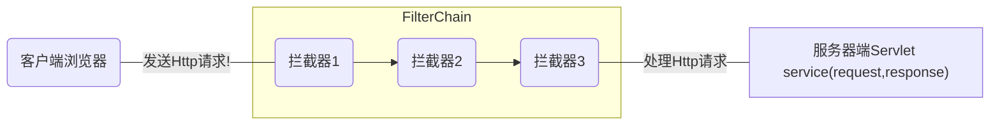
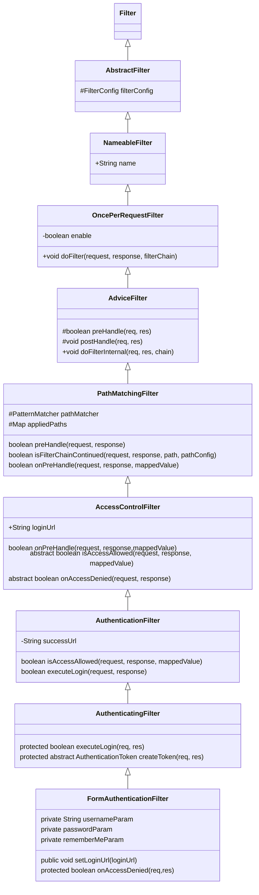

# Filter简介

在接收Shiro之前，先简单介绍一下Filter.因为Shiro是基于Filter来实现认证和权限技术。Filter是Java Web三大组件之一，可以动态的拦截请求和响应，以变换或使用包含在请求或响应中的信息。



## web.xml配置Filter

```xml

<?xml version="1.0" encoding="UTF-8"?>
<web-app version="3.0" 
	xmlns="http://java.sun.com/xml/ns/javaee" 
	xmlns:xsi="http://www.w3.org/2001/XMLSchema-instance" 
	xsi:schemaLocation="http://java.sun.com/xml/ns/javaee 
	http://java.sun.com/xml/ns/javaee/web-app_3_0.xsd">
 
  <filter>
  	<filter-name>CharsetEncodingFilter</filter-name>
  	<filter-class>com.drp.filter.CharsetEncodingFilter</filter-class>
  </filter>
  <filter-mapping><!-- 此filter对所有的jsp页面都有过滤效果 -->
  	<filter-name>CharsetEncodingFilter</filter-name>
  	<url-pattern>*.jsp</url-pattern>
  </filter-mapping>
```

## Springboot注册Filter

```java
@Bean
public FilterRegistrationBean filterRegistrationBean() {
    FilterRegistrationBean filterRegistrationBean = new FilterRegistrationBean();
    filterRegistrationBean.setFilter(new WebStatFilter());
    filterRegistrationBean.addUrlPatterns("/*");
    filterRegistrationBean.addInitParameter("exclusions", 				          					"*.js,*.gif,*.jpg,*.png,*.css,*.ico,/druid/*");
    filterRegistrationBean.addInitParameter("profileEnable", "true");
    filterRegistrationBean.addInitParameter("principalCookieName", "USER_COOKIE");
    filterRegistrationBean.addInitParameter("principalSessionName", "USER_SESSION");
    return filterRegistrationBean;
}
```

# Shiro简介

Shiro是一个开源的java安全（权限）框架，它能够实现身份验证、授权、加密和会话管理等功能。

* ## Authentication

* ## Authorization

* ## Cryptography

* ## Session Management

## Authentication(认证)

用户身份认证使用的是FormAuthenticationFilter拦截器，结构图如下：



### 登录

`subject.login(token)`

1. org.apache.shiro.subject.support.DelegatingSubject

```java
public void login(AuthenticationToken token) throws AuthenticationException {
    clearRunAsIdentitiesInternal();
    Subject subject = securityManager.login(this, token);

    PrincipalCollection principals;

    String host = null;

    if (subject instanceof DelegatingSubject) {
        DelegatingSubject delegating = (DelegatingSubject) subject;
        //we have to do this in case there are assumed identities - we don't want to lose the 'real' principals:
        principals = delegating.principals;
        host = delegating.host;
    } else {
        principals = subject.getPrincipals();
    }

    if (principals == null || principals.isEmpty()) {
        String msg = "Principals returned from securityManager.login( token ) returned a null or " +
            "empty value.  This value must be non null and populated with one or more elements.";
        throw new IllegalStateException(msg);
    }
    this.principals = principals;
    this.authenticated = true;
    if (token instanceof HostAuthenticationToken) {
        host = ((HostAuthenticationToken) token).getHost();
    }
    if (host != null) {
        this.host = host;
    }
    Session session = subject.getSession(false);
    if (session != null) {
        this.session = decorate(session);
    } else {
        this.session = null;
    }
}
```

2. org.apache.shiro.mgt.AuthenticatingSecurityManager

```java
public Subject login(Subject subject, AuthenticationToken token) throws 		     		AuthenticationException {
    AuthenticationInfo info;
    try {
        info = authenticate(token);
    } catch (AuthenticationException ae) {
        try {
            onFailedLogin(token, ae, subject);
        } catch (Exception e) {
            if (log.isInfoEnabled()) {
                log.info("onFailedLogin method threw an " +
                         "exception.  Logging and propagating original AuthenticationException.", e);
            }
        }
        throw ae; //propagate
    }

    Subject loggedIn = createSubject(token, info, subject);

    onSuccessfulLogin(token, info, loggedIn);

    return loggedIn;
}
```

```java
public AuthenticationInfo authenticate(AuthenticationToken token) throws AuthenticationException {
    return this.authenticator.authenticate(token);
}
```

3. org.apache.shiro.authc.AbstractAuthenticator

```java
public final AuthenticationInfo authenticate(AuthenticationToken token) throws AuthenticationException {

    if (token == null) {
        throw new IllegalArgumentException("Method argument (authentication token) cannot be null.");
    }

    log.trace("Authentication attempt received for token [{}]", token);

    AuthenticationInfo info;
    try {
        info = doAuthenticate(token);
        if (info == null) {
            String msg = "No account information found for authentication token [" + token + "] by this " +
                "Authenticator instance.  Please check that it is configured correctly.";
            throw new AuthenticationException(msg);
        }
    } catch (Throwable t) {
        AuthenticationException ae = null;
        if (t instanceof AuthenticationException) {
            ae = (AuthenticationException) t;
        }
        if (ae == null) {
            //Exception thrown was not an expected AuthenticationException.  Therefore it is probably a little more
            //severe or unexpected.  So, wrap in an AuthenticationException, log to warn, and propagate:
            String msg = "Authentication failed for token submission [" + token + "].  Possible unexpected " +
                "error? (Typical or expected login exceptions should extend from AuthenticationException).";
            ae = new AuthenticationException(msg, t);
            if (log.isWarnEnabled())
                log.warn(msg, t);
        }
        try {
            notifyFailure(token, ae);
        } catch (Throwable t2) {
            if (log.isWarnEnabled()) {
                String msg = "Unable to send notification for failed authentication attempt - listener error?.  " +
                    "Please check your AuthenticationListener implementation(s).  Logging sending exception " +
                    "and propagating original AuthenticationException instead...";
                log.warn(msg, t2);
            }
        }


        throw ae;
    }

    log.debug("Authentication successful for token [{}].  Returned account [{}]", token, info);

    notifySuccess(token, info);

    return info;
}
```

4. org.apache.shiro.authc.pam.ModularRealmAuthenticator

```java
protected AuthenticationInfo doAuthenticate(AuthenticationToken authenticationToken) throws AuthenticationException {
    assertRealmsConfigured();
    Collection<Realm> realms = getRealms();
    if (realms.size() == 1) {
        return doSingleRealmAuthentication(realms.iterator().next(), authenticationToken);
    } else {
        return doMultiRealmAuthentication(realms, authenticationToken);
    }
}
```

```java
protected AuthenticationInfo doMultiRealmAuthentication(Collection<Realm> realms, AuthenticationToken token) {

        AuthenticationStrategy strategy = getAuthenticationStrategy();

        AuthenticationInfo aggregate = strategy.beforeAllAttempts(realms, token);

        if (log.isTraceEnabled()) {
            log.trace("Iterating through {} realms for PAM authentication", realms.size());
        }

        for (Realm realm : realms) {

            aggregate = strategy.beforeAttempt(realm, token, aggregate);

            if (realm.supports(token)) {

                log.trace("Attempting to authenticate token [{}] using realm [{}]", token, realm);

                AuthenticationInfo info = null;
                Throwable t = null;
                try {
                    info = realm.getAuthenticationInfo(token);
                } catch (Throwable throwable) {
                    t = throwable;
                    if (log.isDebugEnabled()) {
                        String msg = "Realm [" + realm + "] threw an exception during a multi-realm authentication attempt:";
                        log.debug(msg, t);
                    }
                }

                aggregate = strategy.afterAttempt(realm, token, info, aggregate, t);

            } else {
                log.debug("Realm [{}] does not support token {}.  Skipping realm.", realm, token);
            }
        }

        aggregate = strategy.afterAllAttempts(token, aggregate);

        return aggregate;
    }
```

5. org.apache.shiro.realm.AuthenticatingRealm

```java
public final AuthenticationInfo getAuthenticationInfo(AuthenticationToken token) throws AuthenticationException {

    AuthenticationInfo info = getCachedAuthenticationInfo(token);
    if (info == null) {
        //otherwise not cached, perform the lookup:
        info = doGetAuthenticationInfo(token);
        log.debug("Looked up AuthenticationInfo [{}] from doGetAuthenticationInfo", info);
        if (token != null && info != null) {
            cacheAuthenticationInfoIfPossible(token, info);
        }
    } else {
        log.debug("Using cached authentication info [{}] to perform credentials matching.", info);
    }

    if (info != null) {
        assertCredentialsMatch(token, info);
    } else {
        log.debug("No AuthenticationInfo found for submitted AuthenticationToken [{}].  Returning null.", token);
    }

    return info;
}
```

6. group.rober.auth.shiro.DatabaseRealm

```java
protected AuthenticationInfo doGetAuthenticationInfo(
            AuthenticationToken authenticationToken) throws AuthenticationException {
    //UsernamePasswordToken对象用来存放提交的登录信息
    UsernamePasswordToken token = (UsernamePasswordToken) authenticationToken;

    //查出是否有此用户
    User user = authService.getUserByCode(token.getUsername());   //userName是shiro中的概念,等同于我们的userCode

    if (user == null) {
        setLoginFailMsg(ACOUNT_PWD_INCORRECT_MSG);
        throw new UnknownAccountException("no account code: " + token.getUsername());//没找到帐号
    }

    if(StringKit.isEmpty(user.getStatus())||"1".equals(user.getStatus())){
        user.setStatus(AccountStatus.Using.toString());
    }


    if (!userAccountVerifiers.isEmpty()) {
        for (UserAccountVerifier userAccountVerifier : userAccountVerifiers) {
            try {
                userAccountVerifier.verifyAccount(user);
            } catch (AuthenticationException ex) {
                setLoginFailMsg(ex.getMessage());
                throw ex;
            }
        }
    }

    SimpleAuthenticationInfo authenticationInfo = new SimpleAuthenticationInfo(user, user.getPassword(), getName());

    if (authProperties.isHashSalted() && StringKit.isNoneBlank(user.getHashSalt())) {
        authenticationInfo.setCredentialsSalt(new SimpleByteSource(Base64.getDecoder().decode(user.getHashSalt())));
    }
    return authenticationInfo;
}
```

```java
 protected void assertCredentialsMatch(AuthenticationToken token, AuthenticationInfo info) throws AuthenticationException {
     CredentialsMatcher cm = getCredentialsMatcher();
     if (cm != null) {
         if (!cm.doCredentialsMatch(token, info)) {
             setLoginFailMsg(ACOUNT_PWD_INCORRECT_MSG);
             throw new IncorrectCredentialsWithPrincipalException(info.getPrincipals(), ACOUNT_PWD_INCORRECT_MSG);
         }
     }
     super.assertCredentialsMatch(token, info);
 }
```

7. group.rober.auth.controller.LoginAndOffRestController

```java
public Object login(HttpServletRequest request) throws Exception {
        Subject subject = SecurityUtils.getSubject();
        if (subject.isAuthenticated()) {

            //设置当前用户的系统语言
            subject.getSession().setAttribute(AuthConsts.LANGUAGE,WebUtils.getCleanParam(request, "language"));

            User currentUser = (User) ((WebSubject) subject).getServletRequest().getAttribute(AuthConsts.SESSION_USER);
            Serializable sessionToken = authProperties.isEnableJwtReplaceSession() ?
                    (String) request.getAttribute(AuthConsts.JWT_ATTRIBUTE) : subject.getSession().getId();
            return new LoginResponse(LoginResponse.getSUCCESS(), sessionToken, currentUser);
        } else {
            return LoginResponse.fail((String)request.getAttribute(LOGIN_FAIL_MSG_ATTRIBUTE_NAME));
        }
    }
```

