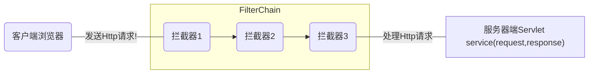

# Filter简介

在接收Shiro之前，先简单介绍一下Filter.因为Shiro是基于Filter来实现认证和权限技术。Filter是Java Web三大组件之一，可以动态的拦截请求和响应，以变换或使用包含在请求或响应中的信息。



## web.xml配置Filter

```xml

<?xml version="1.0" encoding="UTF-8"?>
<web-app version="3.0" 
	xmlns="http://java.sun.com/xml/ns/javaee" 
	xmlns:xsi="http://www.w3.org/2001/XMLSchema-instance" 
	xsi:schemaLocation="http://java.sun.com/xml/ns/javaee 
	http://java.sun.com/xml/ns/javaee/web-app_3_0.xsd">
 
  <filter>
  	<filter-name>CharsetEncodingFilter</filter-name>
  	<filter-class>com.drp.filter.CharsetEncodingFilter</filter-class>
  </filter>
  <filter-mapping><!-- 此filter对所有的jsp页面都有过滤效果 -->
  	<filter-name>CharsetEncodingFilter</filter-name>
  	<url-pattern>*.jsp</url-pattern>
  </filter-mapping>
```

## Springboot注册Filter

```java
@Bean
public FilterRegistrationBean filterRegistrationBean() {
    FilterRegistrationBean filterRegistrationBean = new FilterRegistrationBean();
    filterRegistrationBean.setFilter(new WebStatFilter());
    filterRegistrationBean.addUrlPatterns("/*");
    filterRegistrationBean.addInitParameter("exclusions", 				          					"*.js,*.gif,*.jpg,*.png,*.css,*.ico,/druid/*");
    filterRegistrationBean.addInitParameter("profileEnable", "true");
    filterRegistrationBean.addInitParameter("principalCookieName", "USER_COOKIE");
    filterRegistrationBean.addInitParameter("principalSessionName", "USER_SESSION");
    return filterRegistrationBean;
}
```


